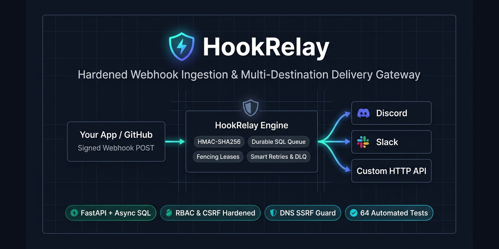
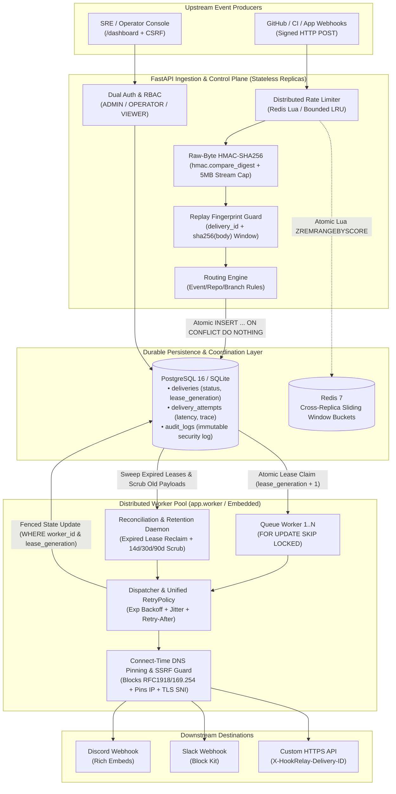
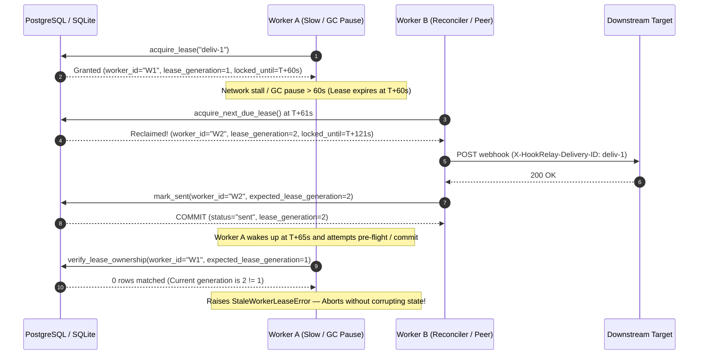

# HookRelay: Hardened Webhook Delivery Infrastructure & Event Gateway

<p align="center">
  
</p>

[](https://github.com/Abhishek-Gali/HookRelay/actions/workflows/ci.yml)
[](https://www.python.org/downloads/)
[](https://fastapi.tiangolo.com)
[](https://github.com/Abhishek-Gali/HookRelay/actions/workflows/ci.yml)
[](https://github.com/Abhishek-Gali/HookRelay/actions/workflows/ci.yml)
[](https://github.com/Abhishek-Gali/HookRelay/actions/workflows/ci.yml)
[](https://opensource.org/licenses/MIT)


> **"A secure API that receives events from applications and reliably delivers them to communication platforms and other HTTP services."**
>
> **HookRelay** is a security-hardened, production-oriented webhook ingestion and multi-provider delivery gateway (`Your App / GitHub ➔ HookRelay ➔ Discord / Slack / Custom HTTP`). Engineered with raw-byte HMAC-SHA256 verification, bounded signed-payload replay detection, SQL-backed durable job queueing with monotonic **fencing tokens** (`worker_id` + `lease_generation` + `locked_until` + `FOR UPDATE SKIP LOCKED`), per-destination partial-failure tracking, unified retry policies respecting `Retry-After`, DNS-validated SSRF-safe routing, automated data retention scrubbing, RBAC-protected management APIs, and an XSS/CSRF-hardened operations console.

---

## 1. What HookRelay Is & How You Can Use It

Instead of writing custom webhook verification, retry loops, rate-limit handling, and error logging inside every script or service you build, **your application or webhook source only needs to send an event to HookRelay once**. HookRelay sits in the middle and handles cryptographic authentication, durable queueing, filtering, retries, and fan-out delivery to all of your configured destinations:

```text
                         ┌──→ Discord 🔵     (Native incoming webhooks + Rich Embeds)
                         │
Your App / GitHub ──→ HookRelay ──→ Slack 🟢       (Native incoming webhooks + Block Kit)
                         │
                         ├──→ Custom API ⚙️  (Generic HTTPS POST with X-HookRelay-Delivery-ID)
                         │
                         └──→ WhatsApp 🟢*   (*Via WhatsApp Business Cloud API / Twilio adapter)
```

### Supported & Extensible Destinations
- **Discord (`provider: "discord"`) — ✅ Native Support:** Uses Discord Incoming Webhook URLs and automatically formats events into color-coded Rich Embeds (with `@everyone`/`@here` mention neutralization).
- **Slack (`provider: "slack"`) — ✅ Native Support:** Uses Slack Incoming Webhook URLs and formats events using Slack Block Kit.
- **Custom HTTP APIs (`provider: "http"`) — ✅ Native Support:** Forwards structured JSON payloads to any internal or external HTTPS microservice with `X-HookRelay-Event` and `X-HookRelay-Delivery-ID` headers so downstream receivers can process events idempotently.
- **WhatsApp / SMS / PagerDuty — ⚠️ Extensible via Provider Adapter or Custom API:** Unlike Discord and Slack, WhatsApp does not provide a simple unauthenticated "incoming webhook URL"—it requires calling the **WhatsApp Business Platform / Cloud API** (or a provider like Twilio) with bearer authentication and message templates. HookRelay can deliver to WhatsApp either by pointing a `"http"` route at your messaging bridge or by registering a `WhatsAppProvider` subclass in [`app/providers.py`](app/providers.py).

### Why Put HookRelay in the Middle?
1. **Talk Once, Fan Out Anywhere:** Your app or GitHub repo sends a single HTTP request to HookRelay; HookRelay routes it to Discord, Slack, and your internal APIs simultaneously based on event type, repository, or branch rules.
2. **Survives Outages & Rate Limits:** If Discord rate-limits you (`HTTP 429 Retry-After`) or Slack is temporarily down (`HTTP 502/503`), your app isn't blocked. HookRelay queues the event in SQL and retries with exponential backoff and jitter.
3. **Partial-Failure Safety:** If a message routes to both Discord and Slack, and Discord succeeds while Slack fails, redriving the delivery from the Dead Letter Queue (DLQ) **only retries Slack**—never duplicating messages to Discord.
4. **Full Auditability & Replay UI:** Inspect every delivery attempt, HTTP status code, and latency in the built-in `/dashboard` console, and replay failed events with one click.

---

## 2. System Architecture & Fencing-Token Lease Lifecycle

### 2.1 End-to-End Ingestion, Durable Queueing & Egress Architecture



### 2.2 Split-Brain Prevention via Monotonic Fencing Tokens (`HR-02` / `HR-03`)



---

## 3. Delivery Guarantees: `At-Least-Once` vs. `Effectively-Once`

Webhook gateways operate across network boundaries where downstream HTTP endpoints (Discord, Slack, third-party APIs) do not participate in two-phase commit (`2PC`) transactions with the gateway's database. Because a worker process could theoretically crash in the millisecond *after* the downstream HTTP server receives the TCP response bytes but *before* the database `COMMIT` marking `status = 'sent'` completes, **true mathematical "exactly-once" delivery across arbitrary external HTTP servers is impossible without downstream cooperation**.

Instead, HookRelay implements **End-to-End At-Least-Once Delivery** paired with **Three-Layer Idempotency & Fencing Controls** to achieve **Effectively-Once Execution**:

| Pipeline Stage | Guarantee | Mechanism Implemented in HookRelay |
|---|---|---|
| **1. Webhook Ingress** | **Exactly-Once Ingestion** | • **Primary Key Deduplication:** `INSERT INTO deliveries ... ON CONFLICT (delivery_id) DO NOTHING` atomically rejects duplicate `X-GitHub-Delivery` UUIDs even under 100+ concurrent requests.<br>• **Signed-Payload Replay Guard (`HR-04`):** Indexes `payload_hash = sha256(raw_body)` + `event_type` within `REPLAY_WINDOW_SECONDS` (300s) so an attacker or buggy sender cannot replay an identical signed body under a freshly generated `X-GitHub-Delivery` UUID. |
| **2. Queue Lease & Worker Coordination** | **Mutual Exclusion + Fenced State Commits** | • **Atomic Row Claim:** Workers claim due jobs via `FOR UPDATE SKIP LOCKED` (PostgreSQL) or serialized `RETURNING` updates (SQLite).<br>• **Monotonic Fencing Tokens (`HR-02`/`HR-03`):** Every claim increments `lease_generation`. Workers verify `(worker_id, lease_generation)` before every HTTP attempt and inside the `WHERE` clause of `mark_sent` / `mark_retry_wait` / `mark_failed_or_dlq`. A zombie worker whose lease expired cannot overwrite state. |
| **3. Multi-Destination Fan-Out** | **Per-Target Idempotency (`only_unsent=True`)** | • **Granular Target Checkpoint (`HR-06`):** Each destination inside `deliveries.destinations` tracks its own state (`pending` ➔ `sent` / `failed`) immediately after each HTTP call.<br>• If Destination 1 (Discord) succeeds (`204`) and Destination 2 (Slack) fails (`503`), subsequent retries and manual DLQ redrives **skip Destination 1** and only retry Destination 2. |
| **4. Downstream Egress (`provider: "http"`)** | **Idempotent Consumer Contract** | • Every outbound HTTP request includes deterministic headers:<br>  `X-HookRelay-Delivery-ID: <delivery_id>`<br>  `X-HookRelay-Event: <event_type>`<br>• Downstream microservices can deduplicate on `X-HookRelay-Delivery-ID` (e.g., `SETNX` in Redis or a unique SQL constraint) to achieve **end-to-end effectively-once processing**. |

---

## 4. Single-Instance (`SQLite`) vs. Distributed Multi-Worker (`PostgreSQL` + `Redis`)

HookRelay is intentionally engineered to run with **zero external dependencies (`SQLite` + in-memory LRU)** for local development and single-node edge deployments, while scaling horizontally to **multi-container API + Worker pools (`PostgreSQL` + `Redis`)** in production without code changes:

| Architectural Dimension | Single-Node Mode (`SQLite` Default) | Distributed Multi-Instance Mode (`PostgreSQL` + `Redis`) |
|---|---|---|
| **Target Use Case** | Local dev, CI tests, single-VM / low-cost edge deployment | High-availability production, multi-replica Kubernetes / ECS / Compose |
| **Write Concurrency** | Process-local `asyncio.Lock` (`DeliveryStore._db_lock`) serializes SQLite write transactions (`WAL` mode + `busy_timeout=5000ms`), preventing `database is locked` errors up to ~720 req/sec burst. | Lock-free concurrent SQL writes across $N$ API replicas (`DeliveryStore._db_lock` is `None`); PostgreSQL MVCC handles thousands of concurrent inserts. |
| **Worker Job Claiming** | Single-statement `UPDATE ... WHERE id = (SELECT ...) RETURNING` claims due rows atomically within the process. | Row-level `SELECT id FROM deliveries ... FOR UPDATE SKIP LOCKED` allows $M$ distributed worker containers to claim disjoint jobs concurrently with zero lock contention. |
| **Rate Limiting** | Bounded-memory `OrderedDict` LRU sliding window (`max_buckets=10,000`) per process. | Shared atomic Redis Lua sliding window (`REDIS_URL=redis://...`) enforcing global rate limits across all API replicas. |
| **Worker Topology** | Embedded background worker + reconciler run inside the FastAPI `lifespan` process. | Standalone worker fleet (`python -m app.worker --concurrency 4`) scales independently from stateless API containers (`ENABLE_EMBEDDED_WORKER=false`). |

### Running Standalone Distributed Workers (`app/worker.py`)
You can scale background queue consumption independently of the HTTP ingestion tier using the dedicated worker entrypoint:

```bash
# Start 4 concurrent queue-consumer loops + reconciliation daemon in a dedicated worker container/process:
python -m app.worker --concurrency 4
```

Or launch the full multi-container topology (`hookrelay` API + `hookrelay-worker` replicas + `postgres:16-alpine` + `redis:7-alpine`) via Docker Compose:
```bash
POSTGRES_PASSWORD=$(python -c "import secrets; print(secrets.token_urlsafe(24))") docker compose up --build -d
```

---

## 5. Load & Concurrency Benchmark Results (`1,000` & `10,000` Webhooks)

Measured using the included [`scripts/benchmark_load.py`](scripts/benchmark_load.py) load harness (`python -m scripts.benchmark_load`) on a single machine (Python 3.13, Windows, SQLite WAL mode with full raw-byte HMAC-SHA256 verification, replay fingerprint lookup, and atomic SQL queue persistence enabled):

| Benchmark Tier | Total Events | Concurrency | Accepted / Dispatched | Errors / Duplicates | Throughput | Mean Latency | p50 Latency | p95 Latency | p99 Latency |
|---|---:|---:|---:|---:|---:|---:|---:|---:|---:|
| **Tier 1: 1,000 Signed Webhooks Ingestion** | `1,000` | `100` clients | `1,000 / 1,000` | `0` (`0.0%`) | **`722.2 req/sec`** | `131.21 ms` | `133.75 ms` | `151.22 ms` | `153.38 ms` |
| **Tier 2: 10,000 Signed Webhooks Ingestion** *(Sustained SQLite write-lock stress)* | `10,000` | `200` clients | `10,000 / 10,000` | `0` (`0.0%`) | **`240.8 req/sec`** | `821.03 ms` | `831.69 ms` | `1,095.33 ms` | `1,143.83 ms` |
| **Tier 3: 4-Worker Distributed Queue Drain** (`bench-worker-0..3`) | `1,000` jobs | `4` workers | `1,000 / 1,000` (`[250, 250, 250, 250]`) | `0` duplicates | **`38.2 jobs/sec`** *(SQLite lock serialized)* | — | — | — | — |

> **Reproduce these benchmarks locally:**
> ```bash
> # Run 1,000 and 10,000 webhook ingestion + 4-worker distributed drain benchmark:
> python -m scripts.benchmark_load --tiers 1000 10000 --workers 4
>
> # Or include the 50,000-event endurance tier:
> python -m scripts.benchmark_load --tiers 1000 10000 50000 --workers 8
> ```

---

## 6. Core Security & Reliability Controls

### 🛡️ Security Hardening
- **Zero Production Default Credentials & Private-Target Guard (`app/config.py`)**: Startup validation rejects blank, weak (`<32` char), or known placeholder keys (`hr_admin_secret_key_12345`, etc.) and forbids `ALLOW_PRIVATE_DESTINATIONS=true` when `ENVIRONMENT=production`.
- **Timing-Safe Raw-Byte HMAC-SHA256 & Signed-Payload Replay Protection (`app/security.py`, `app/store.py`)**:
  - Computes HMAC-SHA256 strictly over raw request stream bytes before JSON parsing and compares via `hmac.compare_digest`.
  - Mitigates `X-GitHub-Delivery` header mutation replays (`HR-04`) by indexing `payload_hash = sha256(raw_body)` + `event_type` within a configurable `REPLAY_WINDOW_SECONDS` (default 300s).
- **Streaming Payload DoS Protection (`read_bounded_body_stream` in `app/main.py`)**: Enforces the 5 MB limit chunk-by-chunk on the incoming stream before buffering into memory, returning HTTP 413 immediately on oversized chunked transfers.
- **Dual Authentication (API Key + `HttpOnly` Session Cookie with CSRF), RBAC & Distributed Rate Limiting (`app/auth.py`, `app/ratelimit.py`)**:
  - Programmatic API clients authenticate via `X-API-Key` verified against SHA-256 hashes in constant time.
  - Browser console operators exchange their key at `POST /api/auth/login` for an `HttpOnly; SameSite=Strict` session cookie (`hr_session`) and must supply `X-CSRF-Token` on all state-changing requests (including `POST /api/auth/logout`).
  - Role hierarchy: `ADMIN` (full control + DLQ discard + audit logs), `OPERATOR` (read + redrive), `VIEWER` (read-only).
  - Supports multi-replica distributed sliding-window rate limiting via atomic Redis Lua scripts (`REDIS_URL`), with bounded-memory `OrderedDict` LRU fallback (`max_buckets=10,000`).
- **Connect-Time DNS-Rebinding & Redirect SSRF Protection (`app/routing.py`, `app/providers.py`)**: Blocks non-HTTPS schemes, `localhost`, loopback (`127.0.0.0/8`, `::1`), RFC1918 private networks (`10/8`, `172.16/12`, `192.168/16`), cloud metadata endpoints (`169.254.169.254`), resolves and pins DNS `A`/`AAAA` records (including IPv4-mapped and NAT64 prefixes) with TLS `sni_hostname` before outbound dispatch, and enforces `follow_redirects=False`.
- **Stored-XSS & Strict CSP without `'unsafe-inline'` (`app/ui/dashboard.html`, `app/ui/dashboard.js`, `app/main.py`)**:
  - Operations console renders all untrusted webhook and downstream error data exclusively via `document.createElement()` and `.textContent` (zero `innerHTML` interpolation).
  - Serves `/static/dashboard.js` and `/static/dashboard.css` from in-memory cached `Response` objects (eliminating `FileResponse` Range-header exposure, `CVE-2025-62727`) with `Content-Security-Policy: default-src 'self'; script-src 'self'; style-src 'self'; frame-ancestors 'none'; object-src 'none'; base-uri 'self'` and `X-XSS-Protection: 0`.
- **Credential-Safe Error Categorization (`format_safe_exception`, `sanitize_error_message` in `app/providers.py`)**: Redacts Discord/Slack tokens, URL userinfo, and query strings from downstream errors, omits raw error bodies on `GenericHttpProvider`, and categorizes exceptions into structured JSON without leaking internal stack traces.

### ⚙️ Distributed Systems & Queue Reliability
- **SQL-Backed Durable Job Queue (`DatabaseQueueBroker` in `app/queue_broker.py`)**:
  - Jobs are persisted in the SQL `deliveries` table at ingestion time—surviving process crashes and container restarts without data loss.
- **Monotonic Fencing Tokens + Ownership-Conditional State Transitions (`acquire_lease`, `_transition_state` in `app/store.py`)**:
  - Every lease acquisition increments a monotonic `lease_generation` counter (`HR-02`, `HR-03`).
  - Workers verify `(worker_id, lease_generation)` before each outbound HTTP attempt and in the `WHERE` clause of `mark_sent`, `mark_failed_or_dlq`, and `mark_retry_wait`. A slow worker whose lease expired and was reclaimed by another worker immediately raises `StaleWorkerLeaseError` and cannot overwrite state.
- **Per-Destination Partial-Failure Tracking (`update_destination_status` in `app/store.py`)**:
  - Multi-destination deliveries track per-target completion (`"status": "pending" | "sent" | "failed"`) inside `deliveries.destinations` (`HR-06`).
  - Redrives and crash reconciliations (`only_unsent=True`) automatically skip destinations that already succeeded (`status == "sent"`), preventing duplicate alerts on partial failures.
- **Automated Data Retention & Payload Scrubbing (`enforce_retention_policy` in `app/store.py`)**:
  - Background reconciliation automatically scrubs raw webhook `payload = NULL` on terminal deliveries older than `PAYLOAD_RETENTION_DAYS` (14d) while preserving the `delivery_id` row for idempotency (`HR-09`), and prunes `delivery_attempts` (30d) and `audit_logs` (90d).
- **Unified Retry Policy (`RetryPolicy` in `app/sender.py` & `app/dispatcher.py`)**:
  - Honors downstream HTTP 429 `Retry-After` headers up to `MAX_RETRY_AFTER_SECONDS` (default 60s) and uses exponential backoff with jitter for 5xx/network errors.

---

## 7. Threat Model Summary (STRIDE)

Full analysis in [docs/threat-model.md](docs/threat-model.md).

| STRIDE Category | Threat Vector | Technical Control | Verified By |
|---|---|---|---|
| **Spoofing** | Forged GitHub webhook | Raw-byte HMAC-SHA256 + `compare_digest` | `tests/test_security.py` |
| **Spoofing** | Mutated `X-GitHub-Delivery` replay | Bounded `payload_hash` replay window (`HR-04`) | `tests/test_webhook_e2e.py` |
| **Spoofing** | Default credentials in prod | Startup validator rejects defaults / keys `<32` chars | `tests/test_auth.py` |
| **Tampering** | Stale worker overwriting state | Monotonic `lease_generation` fencing tokens (`HR-02/03`) | `tests/test_queue_and_leases.py` |
| **Tampering** | Stored XSS in dashboard | Pure DOM `.textContent` rendering + strict CSP | `tests/test_webhook_e2e.py` |
| **Tampering** | Mention injection (`@everyone`) | Universal `sanitize_mentions()` + HTTPS URL validation | `tests/test_formatter.py` |
| **Repudiation** | Unaudited auth failures / replays | Persistent `audit_logs` (never logs raw keys) | `tests/test_webhook_e2e.py` |
| **Info Disclosure** | SSRF to internal/metadata IPs | `resolve_and_pin_destination()` + `ALLOW_PRIVATE` prod block | `tests/test_routing.py`, `tests/test_auth.py` |
| **Denial of Service** | Chunked multi-GB payload | Streaming byte cutoff (`read_bounded_body_stream`) | `tests/test_webhook_e2e.py` |
| **Denial of Service** | API brute-force / redrive flood | Redis Lua / bounded LRU sliding-window rate limiters | `tests/test_webhook_e2e.py` |
| **Elevation of Privilege** | Viewer triggering redrive/discard | Strict RBAC `require_role()` dependency (403) | `tests/test_webhook_e2e.py` |

---

## 8. Quick Start & Local Development

### 1. Clone & Install
```bash
git clone https://github.com/Abhishek-Gali/HookRelay.git
cd HookRelay
python -m venv .venv
source .venv/bin/activate  # Windows: .venv\Scripts\activate
pip install -r requirements.txt
```

### 2. Configure Environment
```bash
cp .env.example .env
# Generate strong 32-byte secrets for production:
python -c "import secrets; print(secrets.token_urlsafe(32))"
```

### 3. Run the Server (with Embedded Worker) or Standalone Worker Fleet
```bash
# Option A: Single-node API + embedded queue worker
uvicorn app.main:app --host 0.0.0.0 --port 8000 --reload

# Option B: Multi-worker distributed pool (requires PostgreSQL in production)
python -m app.worker --concurrency 4
```

### 4. Run the Verification & DevSecOps Suite
```bash
python -m pytest tests/ -v
python -m ruff check app/ tests/ scripts/
python -m mypy app/
python -m bandit -r app/ -ll -ii
```

---

## 9. API & Probe Reference

| Method | Endpoint | Auth / Role | Description |
|---|---|---|---|
| `POST` | `/webhook/github` | GitHub HMAC | Streaming size check, HMAC verify, replay check, atomic claim, durable enqueue |
| `GET` | `/dashboard` | Browser (Session Cookie) | XSS/CSRF-hardened operations & DLQ replay console |
| `POST` | `/api/auth/login` | API Key in body | Exchanges API key for `HttpOnly; SameSite=Strict` session cookie + CSRF token |
| `POST` | `/api/auth/logout` | `VIEWER`+ & CSRF | Revokes active browser session cookie |
| `GET` | `/api/deliveries` | `VIEWER`+ | List deliveries with attempt histories |
| `GET` | `/api/deliveries/{id}` | `VIEWER`+ | Inspect single delivery and per-attempt trace |
| `POST` | `/api/deliveries/{id}/redrive` | `OPERATOR`+ | Replay failed/DLQ delivery (retries only unsent destinations by default) |
| `GET` | `/api/dlq` | `VIEWER`+ | List deliveries in `dead_letter` status |
| `POST` | `/api/dlq/{id}/discard` | `ADMIN` | Transition unfixable DLQ item to `discarded` |
| `GET` | `/api/stats` | `VIEWER`+ | Aggregated delivery, queue depth, & DLQ statistics |
| `GET` | `/api/audit-logs` | `ADMIN` | Security audit trail (`auth_failed`, `authz_denied`, `redrive`, `discard`) |
| `GET` | `/health/live` | Public | Minimal liveness probe (`{"status": "alive"}`) |
| `GET` | `/health/ready` (`/healthz`) | Public | Minimal readiness probe (`{"status": "healthy", "database": "connected"}`) |
| `GET` | `/metrics` | `VIEWER`+ (`REQUIRE_METRICS_AUTH=true`) | Prometheus telemetry metrics |

---

## 10. License

MIT License. Designed and maintained by [Abhishek Gali](https://github.com/Abhishek-Gali).
