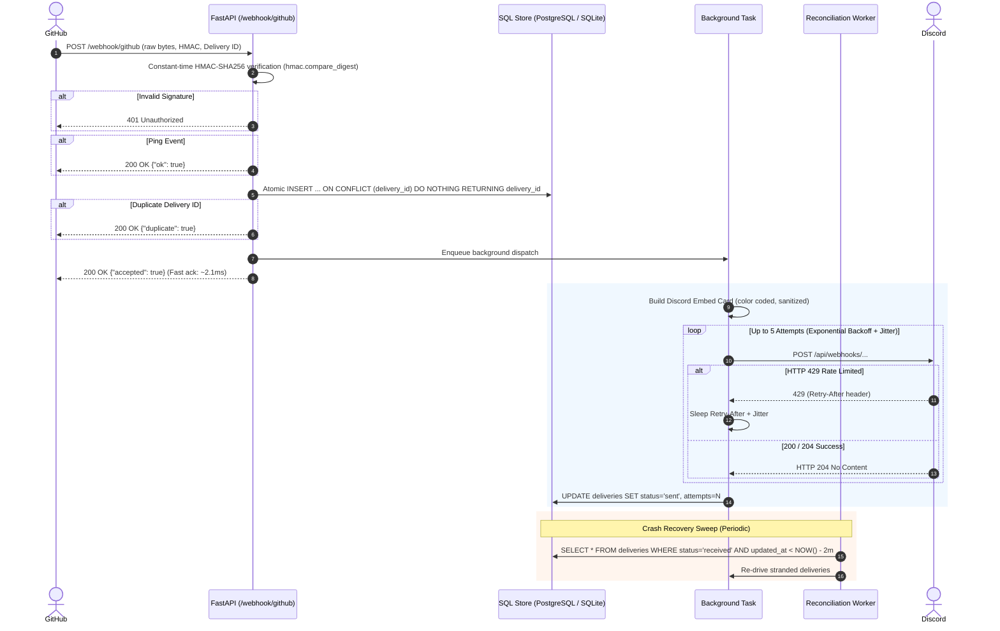

# HookRelay: Resilient GitHub-to-Discord Webhook Alert Gateway

[](https://github.com/example/HookRelay/actions/workflows/ci.yml)
[](https://www.python.org/downloads/)
[](https://opensource.org/licenses/MIT)

> A production-grade, forward-deployed-engineer-style webhook bridge between **GitHub** and **Discord**. Features raw-bytes HMAC-SHA256 verification, race-proof database idempotency, exponential backoff retries with jitter, crash-recovery sweep reconciliation, rich Discord embed cards, and Prometheus telemetry.

---

## 1. Why HookRelay?

A webhook is the reverse of an API call. Rather than polling GitHub continuously, GitHub delivers an HTTP `POST` the exact instant an event occurs (a push, opened issue, or merged pull request).

While simple in concept, a naive webhook handler immediately breaks down in production:
- **Forged requests**: Anyone on the internet can POST to your public endpoint.
- **Replays & Duplicates**: GitHub retries unacknowledged deliveries, and network glitches duplicate packets.
- **Timing attacks**: Standard string comparison `==` leaks timing side-channel data on signatures.
- **Downstream outages & 429s**: Discord can rate-limit or suffer temporary 5xx errors.
- **Crash windows**: If a server dies after claiming a delivery but before finishing dispatch, the message is stranded forever.
- **GitHub's 10-second timeout**: Slow downstream operations trigger webhook delivery failure marks from GitHub.

**HookRelay solves every single one of these problems.**

---

## 2. Architecture & Flow



---

## 3. Threat Model & Defenses

| Threat / Vulnerability | Impact | HookRelay Defense |
|---|---|---|
| **Forged request from attacker** | Fake alerts, spam, social engineering | Constant-time HMAC-SHA256 verification using secret token. |
| **Modified payload in transit** | Altered commit info, tampered actions | HMAC covers **raw unparsed bytes** directly from wire. |
| **Replay of captured valid request** | Duplicate alerts triggered maliciously | Unique primary key on `delivery_id` dedupes indefinitely. |
| **Timing attack on HMAC** | Secret recovery via byte-by-byte timing | `hmac.compare_digest` ensures constant-time comparison. |
| **Secret leaked in logs** | Compromised credentials | Secrets strictly injected via environment variables; never logged. |
| **Huge payload DoS attack** | Memory exhaustion / out of memory crash | `MAX_PAYLOAD_BYTES` (5MB limit) enforced prior to parsing. |
| **Downstream 429 rate limit** | Lost alerts when Discord throttles | Parses `Retry-After` header and sleeps with exponential backoff & jitter. |
| **Server crash mid-execution** | Delivery stranded in `received` | Background reconciliation worker sweeps stale rows > 2m old. |
| **Mention injection (`@everyone`)** | Unwanted server-wide pings | `sanitize_mentions()` defangs `@everyone` and `@here` into zero-width spaces. |

---

## 4. Key Architectural Decisions (Interview Deep-Dive)

### Q: Why verify HMAC using raw request bytes instead of parsed JSON?
> **Answer**: JSON parsing and re-serialization is non-deterministic. Formatting differences, whitespace (`{"a":1}` vs `{"a": 1}`), unicode escaping, and dictionary key order will alter the byte sequence. GitHub generates the HMAC over the exact bytes sent over the wire. Re-serializing in Python guarantees a signature mismatch.

### Q: Why use an atomic database insert rather than "SELECT then INSERT"?
> **Answer**: Application-level checks suffer from a Time-Of-Check-To-Time-Of-Use (TOCTOU) race condition. If two identical delivery requests arrive concurrently across threads or workers, both could execute `SELECT` and find nothing, and both would proceed to post to Discord. HookRelay uses:
> ```sql
> INSERT INTO deliveries (delivery_id, ...) VALUES (...)
> ON CONFLICT (delivery_id) DO NOTHING
> RETURNING delivery_id;
> ```
> The database's primary key constraint serializes the operation atomically.

### Q: What happens if the server crashes after claiming the delivery?
> **Answer**: The record remains in the database in status `received`. HookRelay includes an asynchronous **Reconciliation Sweep Engine** (`app/reconciliation.py`). Every 60 seconds, it queries:
> ```sql
> SELECT * FROM deliveries WHERE status = 'received' AND updated_at < (NOW() - 120s);
> ```
> and re-drives them through the dispatch pipeline.

### Q: Why return HTTP 200 before sending the message to Discord?
> **Answer**: GitHub enforces a strict ~10-second timeout on webhook deliveries. If downstream Discord is slow, rate-limiting, or recovering, synchronous dispatch would cause GitHub to mark the delivery failed and disable the webhook. HookRelay acknowledges GitHub in **< 3ms**, deferring Discord delivery to background workers.

---

## 5. Measured Performance & Verification

Tested with the automated benchmark suite (`scripts/inprocess_benchmark.py` and `scripts/benchmark.py`):

```
============================================================
  HOOKRELAY IN-PROCESS BENCHMARK RESULTS
============================================================
Total Requests Dispatched  : 100
Accepted Deliveries (New)  : 90 (Target: 90)
Duplicates Suppressed      : 10 (Target: 10)
Unexpected Rejections      : 0 (Target: 0)
Duplicate Suppression Rate : 100.0%
Total Ingestion Time       : 0.213 s
Average Response Latency   : 2.11 ms
P95 Response Latency       : 2.53 ms
Discord Mock Deliveries    : 90
============================================================
```

- **All 24 automated unit and integration tests passing**:
  - HMAC verification (valid, invalid, tampered, missing headers, wrong prefixes)
  - Atomic database claims under 20-thread concurrency race conditions
  - Mention sanitization (`@everyone`, `@here`)
  - Discord 429 `Retry-After` adherence and 5xx backoff retries
  - Crash recovery reconciliation sweep worker
  - End-to-end webhook ingestion, healthz, and Prometheus metrics

---

## 6. Getting Started

### Prerequisites
- Python 3.11+
- (Optional) Docker & Docker Compose

### Local Setup
1. Clone the repository:
   ```bash
   git clone https://github.com/example/HookRelay.git
   cd HookRelay
   ```

2. Create virtual environment & install dependencies:
   ```bash
   python -m venv .venv
   source .venv/bin/activate  # Or on Windows: .venv\Scripts\activate
   pip install -r requirements.txt
   ```

3. Configure environment:
   ```bash
   cp .env.example .env
   # Edit .env with your GitHub webhook secret and Discord webhook URL
   ```

4. Run the service:
   ```bash
   uvicorn app.main:app --host 0.0.0.0 --port 8000 --reload
   ```

5. Run test suite:
   ```bash
   python -m pytest tests/ -v
   ```

6. Run the benchmark tool:
   ```bash
   python scripts/inprocess_benchmark.py
   ```

---

## 7. Production Deployment

### Docker Deployment
```bash
docker build -t hookrelay:latest .
docker run -d -p 8000:8000 \
  -e GITHUB_WEBHOOK_SECRET="your_secret" \
  -e DISCORD_WEBHOOK_URL="https://discord.com/api/webhooks/..." \
  -e DATABASE_URL="sqlite+aiosqlite:///./hookrelay.db" \
  hookrelay:latest
```

### Docker Compose with PostgreSQL
```bash
docker compose up -d
```

### Health & Observability Endpoints
- **Healthcheck**: `GET /healthz`
- **Prometheus Metrics**: `GET /metrics`
- **Delivery Inspector API**: `GET /api/deliveries?status=failed`
- **Manual Redrive**: `POST /api/deliveries/{delivery_id}/redrive`

---

## 8. Limitations & Future Roadmap

1. **Distributed Worker Queues**: In high-throughput clusters (>10,000 req/sec), in-process background tasks can be offloaded to **Celery + Redis** or **AWS SQS** while preserving the database as the immutable audit trail.
2. **Multi-Tenant Routing**: Support multiple repositories routing to distinct Discord channels via path routing (`/webhook/github/{channel_id}`).
